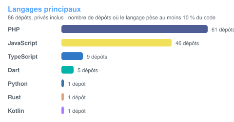

**Kouassi Yanne Cédric Wilson** · Abidjan, Côte d'Ivoire 🇨🇮

---

## 👋 En bref

Développeur full-stack devenu **responsable technique**, je conçois des produits **de bout en bout** : architecture, base de données, back-end, web, mobile, desktop, puis mise en production. Mes terrains de jeu sont **Laravel**, Flutter, React et Rust, avec une place grandissante pour **l'IA** (agents, outils, MCP).

| Rôle | Où |
|---|---|
| 🏢 **Directeur technique IT** | Dominium Tech |
| 🧭 **Lead Tech** | Exceliam |
| 🐘 **Co-fondateur & Lead** | Communauté Laravel Côte d'Ivoire |

- 🌍 **Ce qui me motive** : des produits utiles au contexte ivoirien, comme les ERP pour PME, l'éducation, la restauration ou le paiement mobile money.
- 🤖 **Ce que j'explore** : les agents IA outillés, le Model Context Protocol (MCP) et l'IA embarquée sur mobile.
- 🎤 **Ce que je partage** : talks, meetups et plateforme open source avec Laravel CI.

> 💬 **Ouvert aux échanges** : SaaS, plateformes métier, intégrations IA, mentorat. [Écris-moi](#-me-contacter) !

---

## 🧭 Sommaire

[Chiffres clés](#-en-chiffres) · [Compétences](#️-compétences) · [Réalisations phares](#-réalisations-phares) · [Références clients](#-ils-mont-fait-confiance) · [Tous les projets](#-tous-mes-projets) · [Communauté](#-communauté--prise-de-parole) · [Parcours](#-parcours) · [Statistiques](#-statistiques-github) · [Contact](#-me-contacter)

---

## 📈 En chiffres

| 87 | 20+ | 6 | 4 |
|:---:|:---:|:---:|:---:|
| **dépôts** (67 privés) | **organisations clientes** | **entreprises** où j'ai travaillé ou que je dirige techniquement | **moyens de paiement intégrés** : KKiaPay, FineoPay, Jeko, PayPal |

---

## 🛠️ Compétences

 
 
 

<b>📋 Le détail par domaine</b> (cliquer pour replier)

 

| Domaine | Ce que j'utilise en production |
|---|---|
| **Back-end PHP** | **Laravel 10 → 13** (Livewire 3/4, Filament 5, Jetstream, Fortify, Sanctum, Inertia, Scout + Meilisearch, Telescope), **Symfony 6/7** (Doctrine, Messenger, Twig, API JWT) |
| **Back-end JS / Python** | Node.js, Express 5, Prisma, Sequelize, PostgreSQL · Python, FastAPI, Pydantic, pytest |
| **Front-end** | React 19, Next.js 16, Vue.js, TypeScript, Inertia, Blade, Alpine.js, Tailwind CSS 4, shadcn/ui, Zustand, Redux Toolkit, Chart.js, Leaflet |
| **CMS** | WordPress (Elementor), back-offices et CMS sur mesure en Laravel |
| **Mobile** | **Flutter** (Bloc, GetX, Provider, Clean Architecture, Firebase/FCM) · **Android natif** en Kotlin (Jetpack Compose, Hilt, Room + SQLCipher) |
| **Desktop** | **Tauri 2 + Rust** (Monaco, LSP, sqlx) · **Electron** (mode hors-ligne avec synchronisation) |
| **IA** | Agents avec outils (function calling), **serveurs MCP**, API Anthropic (Claude), OpenAI, Gemini, DeepSeek, OpenRouter, IA embarquée **TensorFlow Lite**, OCR (Tesseract) |
| **Paiement & intégrations** | Mobile money via **KKiaPay**, **FineoPay** et **Jeko** (Wave, Orange, MTN, Moov), PayPal, webhooks signés, OAuth (Google, Facebook, GitHub, Gmail, Outlook), WhatsApp (Twilio / Meta), Web Push, QR codes, PDF, Excel |
| **Architecture** | Multi-tenant (base par tenant ou colonne `tenant_id`), SaaS par abonnement, monolithe modulaire, RBAC fin, files d'attente, temps réel (Reverb, WebRTC/Yjs), ADR |
| **Qualité & DevOps** | Pest (tests d'architecture inclus), PHPUnit, pytest, Locust, Docker, GitHub Actions, Vercel, Render, SEO technique, accessibilité |
| **Reprise de code existant** | Reprise d'applications en production sans documentation : cartographie du code, stabilisation, correctifs critiques (DGI, Elton, Badie, SMS Pro) |
| **Leadership** | Cadrage et architecture, revue de code, Git flow et branches protégées, conventions d'équipe, documentation, animation de communauté, Trello |

---

## 🚀 Réalisations phares

> 🔒 projet privé ou client (code non public) · 🌐 code public

<table>
<tr>
<td width="50%" valign="top">

### 🏢 Intranet Dominium 🔒
Intranet de **pilotage du département technique** de Dominium, qui gère aussi le contenu du site public de l'entreprise.

- Monolithe **modulaire de ~20 modules** : projets, tâches, rapports journaliers, congés, CRM commercial, messagerie interne
- **7 rôles** avec RBAC fin et un tableau de bord par rôle
- **Agent IA** avec outils et **serveur MCP** exposant les données du pôle
- Tests d'architecture Pest, CI, documentation par ADR

`Laravel 13` `Alpine.js` `Tailwind 4` `MCP` `Pest`

</td>
<td width="50%" valign="top">

### 🏭 SmartPME Production 🔒
**ERP SaaS** pour les PME ivoiriennes de transformation et de production.

- **Multi-entreprises** avec abonnements, plans et parrainage
- Production (fiches techniques, lots), stock, devis, factures, caisse
- **Paiement KKiaPay** avec webhook signé
- **Assistant IA** branché sur les indicateurs de l'entreprise
- **Application desktop hors-ligne** (Electron) avec synchronisation

`Laravel 13` `Livewire` `Electron` `KKiaPay` `IA`

</td>
</tr>
<tr>
<td width="50%" valign="top">

### 🤖 JobFinder IA 🔒
SaaS qui **accompagne les candidatures par l'IA**.

- Analyse du CV, **scoring des offres**, CV optimisé et lettre de motivation générés
- Collecte automatique d'offres d'emploi ivoiriennes
- Prompts versionnés et pilotés par l'admin, suivi de la consommation de tokens
- Espaces candidat, entreprise et établissement, abonnements KKiaPay
- **17 modules**, plus de 100 fichiers de tests

`Laravel 13` `LLM` `KKiaPay` `OAuth Gmail/Outlook`

</td>
<td width="50%" valign="top">

### 🍽️ ScanEats 🔒
SaaS **multi-restaurants** : menu par QR code, commande et paiement à table.

- QR codes par menu et par table, **7 thèmes de menu**
- Paiement mobile money via **Jeko** (Wave, Orange, MTN, Moov, Djamo)
- **Import de menu par IA** (OCR + Gemini)
- Gestion de stock, avis clients, notifications push
- Application mobile gérant en Flutter (en cours)

`Laravel 12` `React 19` `Inertia` `Flutter` `Gemini`

</td>
</tr>
<tr>
<td width="50%" valign="top">

### 🧑‍💻 LaravelIDE 🔒
Un **IDE desktop dédié à Laravel**, accompagné de sa plateforme de licences.

- Éditeur Monaco, LSP, terminal, panneaux Artisan, routes, `.env`, base de données, ERD
- **Inspecteur de requêtes N+1**, lanceur de tests, Git
- **Agent IA (Claude)** et intégration de Claude Code
- **Édition collaborative** en temps réel, pair à pair (Yjs + WebRTC)

`Tauri 2` `Rust` `React 19` `Laravel 13`

</td>
<td width="50%" valign="top">

### 🛡️ SafeFind 🔒
Application **Android** de protection contre les contenus explicites.

- **VPN local** codé à la main (relais TCP/UDP, lecture SNI et DNS)
- **Classification d'images sur l'appareil** (TensorFlow Lite)
- Base locale **chiffrée** (SQLCipher), garde d'accessibilité, watchdog
- Cœur réseau couvert par des tests unitaires

`Kotlin` `Jetpack Compose` `Hilt` `TensorFlow Lite`

</td>
</tr>
<tr>
<td width="50%" valign="top">

### 🐘 Hub Laravel Côte d'Ivoire 🌐
Plateforme **open source** de la communauté : forum, blog, événements, job board, espace entreprises et administration.

`Laravel 13` `Livewire 4` `Filament 5` `Reverb` `Meilisearch`

👉 [Voir le dépôt](https://github.com/Laravel-CI-Dev-Space/laravel-ci-platform)

</td>
<td width="50%" valign="top">

### 🏛️ FIDELIA 🌐
**Assistant fiscal** pour la Côte d'Ivoire : TVA, CNPS, échéances DGI et recherche dans le Code général des impôts. Le chat orchestre des outils exposés par un **serveur MCP**.

`FastAPI` `React 19` `MCP` `Docker` `CI`

👉 [Voir le dépôt](https://github.com/Ky-Wilson/FIDELIA)

</td>
</tr>
</table>

---

## 🤝 Ils m'ont fait confiance

<b>Organisations pour lesquelles j'ai conçu ou développé une solution</b>

 

| Organisation | Secteur | Réalisation |
|---|---|---|
| **Dominium Tech** | Services IT | Intranet de pilotage (projets, CRM, IA, MCP) et back-office du site public |
| **Direction Générale des Impôts** *(via EcloStudio)* | Administration fiscale | Reprise et finalisation de l'application de déclaration et de recensement des entreprises, avec géolocalisation par les agents (PostgreSQL, Express, React, Node.js) |
| **Elton** *(via TINITZ)* | Distribution de carburant | Reprise de la plateforme RH : synchronisation du **pointage biométrique** (API Mindtheos), module de planning, refonte du site corporate. Seul responsable de la maintenance |
| **Ivoirrapid** | Livraison express | Plateforme clients, coursiers et administrateurs : commandes, suivi, assignation par zone, KPI |
| **Badie Services** *(via SoftSys)* | Grande distribution | ERP **multi-magasins** (caisse, stock, codes-barres, synchronisation hors-ligne) : reprise, stabilisation en moins de 10 jours, exports et journaux d'actions |
| **3 Voix Academy** | Formation (prise de parole) | Plateforme avec inscriptions, **paiement FineoPay**, newsletter et statistiques de visites |
| **AEEMCI Haut-Sassandra** *(bénévole)* | Association étudiante | Site, back-office, formulaires d'inscription dynamiques, **paiement mobile money KKiaPay** avec webhook, reçus, attribution des dortoirs |
| **2IST Construction** | BTP & immobilier | Site avec back-office (projets, biens, terrains) et SEO technique |
| **Graciel Immobilier** *(via SoftSys)* | Immobilier | Gestion locative (Symfony : baux, quittances PDF) et site avec CMS |
| **Magic Style** | Mode, Canada | Boutique en ligne avec **paiement PayPal en production**, gestion des commandes |
| **KAMA GROUP OPERATOR** | Technologie | Refonte du site vitrine (Livewire 4, accessibilité, SEO) |
| **ARIC Solutions** | Services aux entreprises | Refonte du site : maquette UI, CMS sur mesure, livrée en une semaine en équipe |
| **NORMA SYNERGIES** | Conseil en gestion des risques | Site vitrine et formulaire de contact |
| **JCI — CAMO/AMEC 2026** | Conférence internationale | Site de la conférence JCI Africa & Middle East à Abidjan |
| **BOQER** *(via SoftSys)* | Librairie & papeterie | Caisse avec **tickets pour imprimante thermique**, stock, import Excel/PDF, alertes de rupture |
| **FDMA Travaux Bâtiment** *(via SoftSys)* | BTP | Site avec back-office (projets, annonces) |
| **SOGEGAR** *(via SoftSys)* | Gares routières | Site institutionnel |
| **SDFAC Expertise** *(via SoftSys)* | Expertise comptable | Site vitrine et formulaire de contact |
| **La Glorieuse Internationale** *(via SoftSys)* | ONG | Site, contact et candidatures bénévoles |
| **EDF Power Solutions CI** *(via TINITZ)* | Énergie | Site corporate WordPress, en équipe |
| **Auto-école GOURI** | Formation au permis | Site avec inscription en ligne aux formations |
| **Innoval Groupe** | Aviculture | Site institutionnel |
| **Access Informatique** | Éditeur de logiciels | Site vitrine des produits |

---

## 📂 Tous mes projets

Clique sur une catégorie pour la déplier 👇

<b>🏢 SaaS & logiciels de gestion</b>

 

- **SmartPME Production** — ERP multi-entreprises, KKiaPay, IA, desktop hors-ligne 🔒
- **Intranet Dominium** — pilotage technique, CRM, agent IA + MCP 🔒
- **ImmoManager Pro** — SaaS de gestion locative multi-agences, 4 espaces (admin, agence, propriétaire, locataire), contrats et reçus PDF 🔒
- **Gestion locative Graciel** — application Symfony 6 : baux, quittances, sauvegardes, journaux de sécurité 🔒
- **Badie Services** — ERP de grande distribution : caisse, stock multi-magasins, codes-barres, synchronisation (reprise et évolution) 🔒
- **BOQER** — caisse et stock d'une librairie, tickets thermiques 🔒
- **TransacExtract** — **OCR** des relevés mobile money pour les points de vente : prétraitement d'image, extraction automatique, totaux, 3 profils, export PDF 🔒
- **GfApp** — gestion budgétaire multi-entreprises par abonnement (en cours) 🔒
- **SMS Pro** — plateforme d'envoi de SMS en masse en Symfony 7 : reprise et correction des files d'attente et des timeouts, API JWT 🔒
- **DGI — déclaration des entreprises** — dépôt et suivi de dossiers, géolocalisation, PDF, journal d'audit (PostgreSQL, Express, React, Node.js) 🔒
- **Ivoirrapid** — plateforme de livraison express livrée en 5 semaines 🔒
- **Plateforme RH Elton** — synchronisation du pointage biométrique, planning des employés 🔒

<b>🤖 Intelligence artificielle</b>

 

- **JobFinder IA** — accompagnement des candidatures par LLM 🔒
- **Talks** — chatbot pour entreprises nourri de leurs données métier : widget intégrable, devis et recommandations, historique des conversations (Laravel + OpenAI, en cours) 🔒
- **Support Ticketing** — package Laravel prêt à l'emploi : widget de support, **détection automatique des bugs** en production, tickets, authentification par clé API 🔒
- **LaravelIDE** — agent Claude intégré à un IDE desktop 🔒
- **ScanEats** — import de menus par OCR + Gemini 🔒
- **SafeFind** — classification d'images embarquée (TensorFlow Lite) 🔒
- **[FIDELIA](https://github.com/Ky-Wilson/FIDELIA)** — assistant fiscal, serveur d'outils MCP 🌐
- **Tu me connais ?** — jeu de couple avec questions générées par IA 🔒

<b>📱 Mobile & desktop</b>

 

- **SafeFind** — Android natif (Kotlin, Compose, VPN local) 🔒
- **Kardz** — cartes de visite numériques : QR code, scanner, vCard, connexion par OTP, statistiques de scans (Flutter + API Laravel) 🔒
- **Fitness App** — gestion d'une chaîne de salles de sport : API de 45 routes, 4 rôles, Flutter en Clean Architecture et Bloc 🔒
- **E-commerce mobile** — boutique et panneau admin (Flutter, GetX, Firebase) 🔒
- **LaravelIDE** — desktop Tauri 2 + Rust 🔒
- **SmartPME Desktop** — Electron, mode hors-ligne avec synchronisation 🔒

<b>🛒 E-commerce, restauration & immobilier</b>

 

- **ScanEats** — commande au restaurant par QR code 🔒
- **ShopifyClone** — SaaS multi-boutiques avec **une base de données par boutique** 🔒
- **[Magic Style](https://github.com/Ky-Wilson/Magic-Style)** — boutique de mode pour une cliente au Canada : PayPal en production, coupons, livraison par tranches de poids 🌐
- **Boutique avec Google Auth** — catalogue Livewire, frais de livraison par commune, chat client relayé sur WhatsApp 🔒
- **[BtpApp](https://github.com/Ky-Wilson/BtpApp)** — annonces immobilières multi-entreprises avec modération, visites et avis 🌐
- **Gestion hôtelière** — multi-hôtels, rôles admin et gérant, 2FA, Google OAuth (React + Inertia) 🔒

<b>🎓 Éducation & associatif</b>

 

- **Plateforme d'orientation scolaire** — annuaire, comparateur et recherche Meilisearch, 3 espaces Filament (MVP) 🔒
- **AEEMCI** — inscriptions avec paiement KKiaPay 🔒
- **3 Voix Academy** — inscriptions et paiement FineoPay 🔒
- **ARTICONNECT** — mise en relation d'artisans et de clients, projet de fin de licence à l'UVCI 🔒

<b>🧪 Exercices, tests techniques & apprentissage</b>

 

- **[GeoPatrimoine CI](https://github.com/Ky-Wilson/Application-de-g-olocalisation-de-patrimoine)** — carte du patrimoine, recherche par proximité (Leaflet, Haversine) 🌐
- **[TestRecrutement](https://github.com/Ky-Wilson/TestRecrutement)** — API Express 5 + Prisma, JWT et Swagger 🌐
- **[MERN Expense Tracker](https://github.com/Ky-Wilson/MERN-Project)** — API Express et MongoDB, export Excel 🌐
- **[Auth sociale Laravel](https://github.com/Ky-Wilson/Auth-With-Google--laravel)** — connexion Google, Facebook et GitHub 🌐
- **Newsletter & blog** — modération des commentaires, envoi d'e-mails déclenché par événement 🔒
- **Temps réel avec Reverb** — notifications privées par utilisateur 🔒
- Exercices React + Inertia (CRUD, tâches, rôles), API Sanctum, intégration PayPal 🔒

---

## 🎤 Communauté & prise de parole

**Laravel Côte d'Ivoire** · *co-fondateur & lead*

- 🗓️ **Laravel CI Meet #01** — *« L'IA au service des développeurs Laravel »*, le 12 septembre 2026 à **Epitech Abidjan**
- 🎙️ **Mon talk** — *« Le Hub de la communauté Laravel CI »* : présentation de la plateforme open source
- 🛠️ Lead technique du hub : architecture, revue des contributions, conventions d'équipe

---

## 🎓 Parcours

### 💼 Expériences

| Période | Poste | Ce que j'y ai fait |
|---|---|---|
| Aujourd'hui | **Directeur technique IT** · Dominium Tech | Direction technique, intranet de pilotage, plateforme du site public |
| Aujourd'hui | **Lead Tech** · Exceliam | Encadrement technique, architecture, revue de code |
| 2026 | **Développeur full-stack** · TINITZ | Reprise de la plateforme RH d'Elton (pointage biométrique, planning), sites corporate |
| juin → déc. 2025 | **Développeur web & mobile** · SoftSys | Création et maintenance d'applications Laravel et Symfony : ERP, e-commerce, gestion immobilière, stock et ventes, sites vitrines |
| fév. → mai 2025 | **Consultant full-stack** · EcloStudio | Évolution de l'application de déclaration des entreprises de la DGI (React, Node.js), application événementielle (Laravel) |
| nov. 2024 → avr. 2025 | **Développeur web & mobile** · Ivoirrapid | Plateforme de livraison express conçue seul et livrée en 5 semaines, maintenance |

### 📚 Formation & certifications

| Période | Diplôme / programme |
|---|---|
| 2024 → | **Master Informatique et Sciences du Numérique**, option Big Data Analytique · UVCI |
| 2025 | **Certificat Développeur web et mobile** · Epitech Côte d'Ivoire, WeCode |
| avr. → nov. 2024 | **Formation développement full-stack** · Epitech WeCode, Abidjan |
| 2021 → 2024 | **Licence Informatique et Sciences du Numérique**, option Développeur d'applications · UVCI |
| 2023 → | **Ambassadeur du Numérique** · DTC-EMSP Côte d'Ivoire |

---

## 📊 Statistiques GitHub

<b>Dépôts privés et publics confondus</b> (cliquer pour replier)

 

Les statistiques sont régénérées chaque jour par une GitHub Action et incluent les dépôts privés.

---

## 📫 Me contacter

| Canal | Lien |
|---|---|
| 📧 Personnel | [yanne.kouassi@epitech.eu](mailto:yanne.kouassi@epitech.eu) |
| 🏢 Dominium Tech | [leadtech@dominium-civ.com](mailto:leadtech@dominium-civ.com) |
| 🧭 Exceliam | [wilson.kouassi@exceliam.com](mailto:wilson.kouassi@exceliam.com) |
| 💼 LinkedIn | [Wilson Kouassi](https://www.linkedin.com/in/yanne-cedric-wilson-kouassi-17bb12303) |
| 🌍 Portfolio | [hlabdev.netlify.app](https://hlabdev.netlify.app/) |
| 🐘 Communauté | [Laravel Côte d'Ivoire](https://github.com/Laravel-CI-Dev-Space/laravel-ci-platform) |

**Un projet, une idée, une question ?** Je réponds toujours avec plaisir. 🚀

